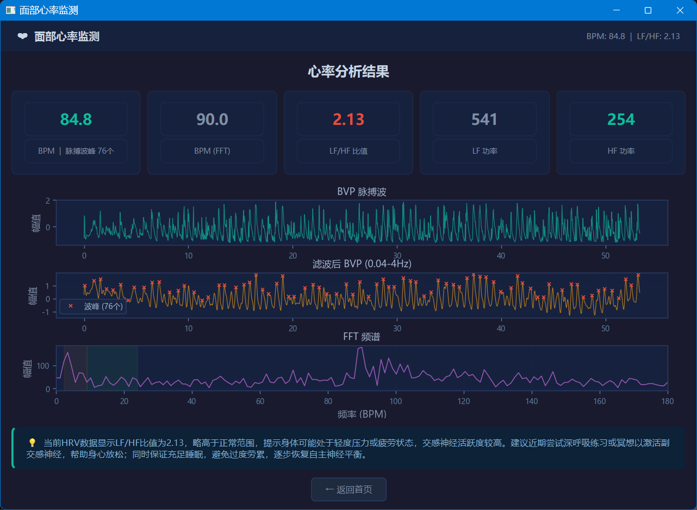

# 面部心率监测 Face Heart Rate Monitor

基于摄像头视频的非接触式心率与心率变异性（HRV）分析桌面应用。核心 rPPG 算法基于 [FacePhys](https://github.com/KegangWangCCNU/FacePhys-Release) — 一种使用状态空间模型（SSM）的轻量级远程光电容积描记法，模型仅 **4MB**。

## 功能

- **实时人脸检测** — 基于 [yolo-face](https://github.com/akanametov/yolo-face)（YOLOv8n-face ONNX），支持多人脸框选与关键点显示
- **非接触式心率测量** — 通过面部视频帧提取血容量脉冲（BVP）信号，计算瞬时心率和 HRV 指标
- **双模式 BPM 计算** — 时域峰值检测 + 频域 FFT 主频分析
- **HRV 频谱分析** — LF（0.04-0.15Hz）/ HF（0.15-0.4Hz）功率及 LF/HF 比值
- **AI 健康建议** — 通过 Agnes AI API（agnes-2.0-flash）生成个性化健康解读
- **可视化报告** — BVP 波形、滤波信号、波峰标记、FFT 频谱三合一图表，支持深色主题
- **交互式采集流程** — 开始/暂停/继续/重置采集，圆形进度指示器

## 工作流程

```
摄像头 → YOLOv8 人脸检测 → 裁剪人脸 (36×36) → 缓存 1600 帧 (~53s)
  → FacePhys SSM 推理 BVP 信号 → HRV 分析（峰值/FFT）→ AI 建议
```

## 依赖

| 依赖 | 用途 |
|---|---|
| PySide6 ≥ 6.5 | Qt GUI 框架 |
| opencv-python ≥ 4.8 | 摄像头、图像处理、可视化 |
| onnxruntime ≥ 1.17 | YOLO 人脸检测 + FacePhys BVP 推理 |
| numpy ≥ 1.22 | 数值计算 |
| scipy ≥ 1.9 | 峰值检测、滤波器、FFT |
| matplotlib ≥ 3.7 | 结果图表绘制 |
| Pillow ≥ 10.0 | 图像处理 |

## 安装

### 1. 克隆

```bash
git clone https://github.com/RC16348/face-hr-monitor.git
cd face-hr-monitor
```

### 2. 安装依赖

```bash
pip install -r requirements.txt
```

### 3. 下载模型

将以下模型放入 `models/` 目录：

| 文件 | 来源 | 用途 |
|---|---|---|
| `yolov8n-face.onnx` | [yolo-face](https://github.com/akanametov/yolo-face) | 人脸检测 |
| `model.onnx` | [FacePhys](https://github.com/KegangWangCCNU/FacePhys-Release) | BVP 推理（SSM 模型） |
| `state.gz` | [FacePhys](https://github.com/KegangWangCCNU/FacePhys-Release) | 推理初始状态 |

### 4. 配置 AI 建议密钥

编辑 `agnes_client.py`，将 `DEFAULT_API_KEY` 替换为你的 [Agnes AI](https://apihub.agnes-ai.com) API 密钥：

```python
DEFAULT_API_KEY = "你的密钥"  # → 替换为真实密钥
```

## 运行

```bash
python main.py
```

## 截图



## 使用

1. **启动** — 应用打开后自动启动摄像头，画面显示实时人脸检测
2. **开始采集** — 点击「开始采集」，系统开始缓存人脸帧（共 1600 帧，约 53 秒）
3. **停止/继续** — 可随时暂停再继续，进度圈显示当前采集进度
4. **等待分析** — 采集完成后自动进行 FacePhys BVP 推理和 HRV 分析
5. **查看结果** — 展示 BPM、LF/HF 等指标，三合一图表（BVP 原始波形、滤波+波峰、FFT 频谱）
6. **AI 建议** — 自动生成个性化健康解读

## 项目结构

```
face-hr-monitor/
├── main.py                  # 入口
├── agnes_client.py          # Agnes AI API 客户端
├── requirements.txt
├── README.md
├── models/                  # ONNX 模型
│   ├── yolov8n-face.onnx    # 人脸检测（yolo-face）
│   ├── model.onnx           # BVP 推理（FacePhys SSM）
│   └── state.gz             # 推理初始状态
├── core/                    # 核心逻辑
│   ├── __init__.py
│   ├── detector.py          # YOLO 人脸检测（ONNX Runtime）
│   ├── collector.py         # 人脸缓存 + 裁剪（1600帧环形缓冲）
│   ├── inferencer.py        # FacePhys ONNX BVP 推理（SSM 逐帧状态递推）
│   ├── analyzer.py          # HRV 分析（峰值检测 + FFT + LF/HF）
│   └── advice.py            # AI 健康建议（调用 Agnes API）
├── ui/                      # 图形界面
│   ├── __init__.py
│   ├── main_window.py       # 主窗口 + 多线程 Workers
│   ├── camera_widget.py     # 摄像头画面绘制（OpenCV → QPainter）
│   └── result_widget.py     # 结果展示（matplotlib 图表 + 指标卡片）
└── output/                  # 输出目录
```

## 技术细节

### 采集

- 帧率: 30 FPS
- 采集帧数: 1600（约 53 秒）
- 人脸裁剪: 36×36 RGB，扩边 20%，值域归一化到 [0,1]（float16 存储）
- 进度指示: 圆形进度圈叠加在摄像头画面右上角

### BVP 推理（FacePhys）

- 架构: 状态空间模型（State Space Model）
- 输入: 逐帧 36×36 人脸 ROI（float32）
- 输出: 单标量 BVP 值
- 序列长度: 1600 点
- 模型大小: 4MB
- 推理引擎: ONNX Runtime（CPU ~180 FPS）
- 状态管理: 从 `state.gz` 加载 26 个 SSM 状态张量，逐帧递推

### HRV 分析

- 预处理: 去均值 → 带通滤波 0.04-4.0 Hz（4 阶 Butterworth，filtfilt 零相位）
- 峰值 BPM: `scipy.signal.find_peaks(distance=15)` → 峰间间隔均值 → `60 / mean`
- FFT BPM: 30-220 BPM 频段内幅值最大频率 → `freq × 60`
- LF/HF: 低频 0.04-0.15 Hz / 高频 0.15-0.4 Hz 功率积分比值
- 健康解读: LF/HF < 1 放松 / 1-2 正常 / > 2 紧张疲劳

### 多线程架构

- **CameraWorker**（QThread）— 摄像头帧采集 + YOLO 检测 + 人脸缓存
- **InferenceWorker**（QThread）— FacePhys BVP 推理 + HRV 分析
- **AdviceWorker**（QThread）— Agnes AI API 调用获取建议
- 主线程仅负责 UI 渲染和信号响应

## License

MIT
